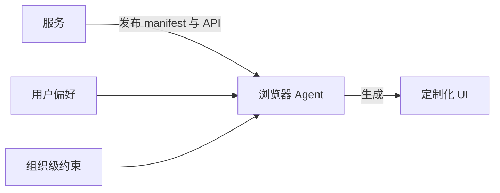

> 译文说明：本文为英文文章 _What if your browser built the UI for you?_ 的中文翻译，尽量保留原文的技术语境与论述风格。
>
> 来源：Jonno White，[https://jonno.nz/posts/what-if-your-browser-built-the-ui-for-you/](https://jonno.nz/posts/what-if-your-browser-built-the-ui-for-you/)

我们正处在前端开发一个颇为特殊的转折点上。AI 已经能够生成完整界面，LLM 也能够理解数据与布局；但即便如此，大多数 SaaS 产品交付的，依然是由人编写的 React 应用。每个产品都在重复实现自己的 UI、无障碍、主题和响应式断点。虽非全部如此，但绝大多数确实如此。

这背后其实投入了大量重复工作，而大家做的，本质上都是同一件事：**把数据呈现给用户，再让用户完成操作**。

我最近在思考这件事，也做了 PoC 来验证一个想法：如果 UI 不是由服务端或前端应用生成，而是由浏览器自己生成，会怎样？

## 现状

整个行业都在从不同方向逼近这个想法，但还没有谁真正把它完整落地。

[服务端驱动 UI](https://www.apollographql.com/docs/graphos/schema-design/guides/sdui/basics) 已经存在一段时间了。Airbnb 等公司最早在移动端推动这套方案，原因也很现实：应用商店审核周期太长，UI 变更难以及时发布。在这种模式下，服务端下发一棵描述渲染内容的 JSON 树，客户端只负责按指令渲染。这种方式确实很高效，但最终的控制权仍然掌握在服务端。

Google 最近推出了 [Natively Adaptive Interfaces](https://developers.google.com/natively-adaptive-interfaces)，这是一个借助 AI agent 将无障碍从“事后补充”转变为“默认能力”的框架。这个方向是对的，也很值得关注。但它仍然局限于单个应用内部。你的无障碍偏好，并不会在 Google 的产品和某个项目管理工具之间自然延续。

然后还有这一波 [生成式 UI](https://www.copilotkit.ai)。CopilotKit、Vercel 的 AI SDK 以及其他一些框架，都在让 LLM 动态生成组件。这些当然是很强的开发工具，但终究仍然是开发工具。生成过程发生在构建阶段，或者发生在服务端，控制权依然掌握在服务提供方手中。

共同点其实很明确：这些方案都把主导权留在了服务端。

## 反过来想

如果 UI 的生成发生在浏览器端，而不是服务端，会怎样？

这正是 [adaptive browser](https://github.com/jonnonz1/adaptive-browser) 背后的核心想法。服务不再向你交付一个完整的前端应用，而是发布一份 manifest，也就是一份结构化的能力说明。它描述自己能做什么、有哪些端点、数据结构是什么样、支持哪些操作。你可以把它理解成一种更“语义化”的 API 规范。它不只是说“这里有个 GET 接口”，而是说“这里有一个仓库列表，可以按 star 数和语言排序，还支持创建、删除、加星和 fork”。

浏览器拿到这份 manifest，调用真实 API，获取真实数据，然后根据你的偏好生成 UI。你的字号、配色方案、偏好的布局方式（表格、卡片还是看板），以及无障碍需求，都可以在所有服务中统一生效。

像 GitHub 这样的服务，它的 manifest 大致可能长这样，也就是服务只描述自己的能力，剩下的交给浏览器决定：

```yaml
service:
  name: "GitHub"
  domain: "api.github.com"
capabilities:
  - id: "repositories"
    endpoints:
      - path: "/user/repos"
        semantic: "list"
        entity: "repository"
        sortable_fields: [name, updated_at, stargazers_count]
        actions: [create, delete, star, fork]
```

浏览器接收这些信息，拉取数据，再根据“你是谁”、“你想完成什么”，借助 LLM 推断出最合适的呈现方式，生成一个贴合用户需求的界面。

## 这件事的重要性，可能比听起来更大

我之前在 Xero 做应用商店和集成平台时，始终被一个问题困扰：每个第三方集成都有自己的一套 UI 约定。用户每接触一个新应用，就得重新学习一套界面。如果 UI 是浏览器基于一组共享偏好自动生成的，这个问题基本就消失了。

但真正最重要的，还是无障碍。现在的无障碍更像是后补上的功能，而且往往完成得并不理想。如果 UI 由浏览器生成，无障碍就不再是“一个功能”，而会成为默认前提。你的偏好，比如高对比度、键盘优先导航、屏幕阅读器优化、更大的字号，都可以在所有地方自动生效。这并不依赖每个开发者都记得实现这些能力，而是因为这些能力从一开始就内建在 UI 的生成机制里。

个性化也会真正回到“属于个人”这件事上。不是“从开发者提供的三个主题里选一个”，而是“这就是我使用软件的方式，而且适用于所有软件”。

## 但这种取舍也是真实存在的

前端复杂度会大幅下降，但复杂度不会消失，它只是转移到了 API 背后。坦率地说，那里的复杂度很可能还会更高。

API 设计会一下子变得重要得多。你不能再随手拼几个 REST 端点就算完事。你的 manifest 必须具备语义，它描述的不只是“数据长什么样”，还要说明“这些数据意味着什么”。服务之间的数据约定俗成会更重要，版本管理也会更重要。



但关键在于，这个取舍会把我们推向一个更有价值的方向。如果每个服务都必须通过 API 和 manifest 以语义化的方式描述自己，那么 API 就会成为产品真正的外部接口，而不再是前端。真正构成产品外部形态的，将是 API。

而一旦 API 成为产品的外部接口，平台之间如何共享上下文，就会变成最值得关注的问题。你的项目管理工具知道你在做什么，邮箱知道你在和谁沟通，代码编辑器知道你正在构建什么。但现在，这些工具几乎无法以真正有意义的方式彼此协同，因为它们都被各自的 UI 限制住了。在一个由 manifest 驱动的世界里，这些上下文会通过 API 流动，而你的浏览器可以把它们组织成一个连贯的工作界面。

## 接下来会走向哪里（我的看法）

我觉得，大概再过 3 到 5 年，这件事就会开始进入主流。所需的条件其实已经差不多具备了：能够理解 UI 的 LLM、围绕通过 API 传递 UI 意图而展开的[标准化探索](https://www.builder.io/blog/ui-over-apis)，以及用户越来越明确的预期（也就是软件应该适应他们，而不是反过来）。

在这个世界里胜出的服务，不会是那些人工打磨 UI 做得最漂亮的，而会是那些 API 最好、manifest 最丰富、数据最有价值的服务。前端会从需要由人实现的界面层，变成按需自动生成的结果。

组织会设定偏好的约束条件，比如“员工可以使用深色或浅色模式”“高风险操作必须二次确认”“某些字段必须始终可见”，而个人则在这些边界之内继续定制。你的浏览器会变成你的 agent，而不只是一个渲染器。

我做了一个 [adaptive browser](https://github.com/jonnonz1/adaptive-browser) 作为 PoC 来测试这套想法。它使用 Claude，根据 GitHub manifest 和 YAML 形式的用户偏好生成 UI。现在它还比较初步，但我认为方向是对的。

前端不会消失。但我们今天所理解的“前端开发”很快就会改变。更值得投入的工作，会转向 API 设计、语义化数据契约，以及构建足够聪明、能够成为真正用户代理的浏览器。
